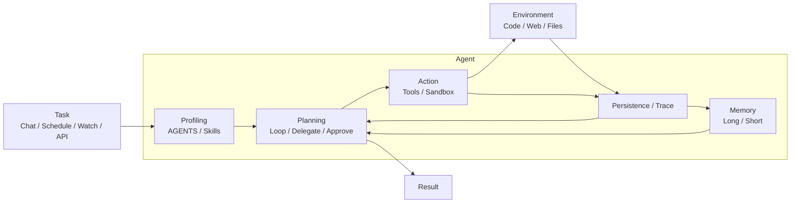

# 🦉 Commander

AI agent for R&D software engineering work

[](https://github.com/kmori6/commander/actions/workflows/test.yaml)
[](https://github.com/kmori6/commander/actions/workflows/lint.yaml)

## Prerequisites

- [Rust](https://www.rust-lang.org/tools/install) 1.85+
- [Docker](https://docs.docker.com/get-docker/)
- [markitdown](https://github.com/microsoft/markitdown) (`pip install markitdown`)
- AWS account with Bedrock access
- [Tavily](https://tavily.com/) API key

## Setup

1. Start PostgreSQL and run migrations:

   ```bash
   docker compose up -d postgres flyway-admin flyway-agent
   ```

2. Build the shell tool sandbox image:

   ```bash
   docker build -t commander-shell:latest docker/
   ```

3. Copy `.env.sample` to `.env` and fill in your credentials:

   ```bash
   cp .env.sample .env
   ```

4. Fill in your AWS credentials and other API keys in `.env` (see `.env.sample` for the full list of variables).

## Installation

```bash
cargo install --path .
```

## Usage

### Server

Start the local HTTP/SSE server.

```bash
commander serve
```

By default, the server listens on `0.0.0.0:3000`.

```bash
commander serve --addr 127.0.0.1:3000
```

### Chat

Start the server-backed chat CLI.

```bash
commander chat
```

Use a different server or resume an existing session:

```bash
commander chat --base-url http://localhost:3000
commander chat --session-id <uuid>
```

| Command                           | Description                    |
| --------------------------------- | ------------------------------ |
| `/new`                            | Start a new session            |
| `/tools`                          | Show tool execution status     |
| `/usage`                          | Show session token usage       |
| `/exit`                           | Quit                           |

### Slack

Start the Slack channel process after `commander serve` is running.

```bash
commander slack
```

Environment variables:

- `SLACK_APP_TOKEN`
- `SLACK_BOT_TOKEN`
- `SLACK_PROACTIVE_CHANNEL` (optional) channel ID for schedule/watch notifications

## Architecture



Reference: [A Survey on Large Language Model based Autonomous Agents](https://arxiv.org/abs/2308.11432)

### Channels

Channels are optional presentation processes that connect chat apps to `commander serve`.

```text
Slack -> commander slack -> commander serve
Schedule / Watch -> commander serve SSE -> commander slack -> Slack
```

Slack keeps thread-to-session mappings in memory. Proactive notifications use live SSE events, so they are not queued while `commander slack` is stopped.

## Features

### Skill

Skills are reusable workspace instructions for specialized workflows.
Add a skill as `~/.commander/workspace/skills/<name>/SKILL.md`:

```markdown
---
name: skill-name
description: A description of what this skill does and when to use it.
---

# Instructions

...
```

Reference: [Agent Skills Specification](https://agentskills.io/specification)

### Instructions

Add workspace-wide agent instructions in `~/.commander/workspace/AGENTS.md`.

Reference: [AGENTS.md](https://github.com/agentsmd/agents.md)

### Memory

Memory stores workspace context in two files; edit them directly to add or update memory:

- Long-term: `~/.commander/workspace/memory/MEMORY.md`
- Short-term: `~/.commander/workspace/memory/journals/YYYY-MM-DD.md`

### MCP Tools

Commander loads stdio MCP servers from `~/.commander/config/mcp.json` when `commander serve` starts.
Create the file with one or more servers:

```json
{
  "mcpServers": {
    "filesystem": {
      "command": "npx",
      "args": ["-y", "@modelcontextprotocol/server-filesystem", "/path/to/root"],
      "env": {}
    }
  }
}
```

Restart `commander serve`, then run `/tools` in `commander chat`.
MCP tools are exposed as `mcp__<server>__<tool>`.

### Schedule

Schedule creates recurring tasks from saved requests.
Create one with the HTTP API:

```bash
curl -X POST http://localhost:3000/v1/schedules \
  -H 'Content-Type: application/json' \
  -d '{
    "title": "Morning review",
    "request": "Review recent tasks and continue useful work.",
    "cron": "0 9 * * 1-5",
    "timezone": "Asia/Tokyo",
    "enabled": true
  }'
```

Schedules are stored in `~/.commander/schedules/crons.json`.
Use `POST /v1/schedules/{id}/run` to run one manually.

### Watch

Watch runs Commander on a schedule using instructions from `WATCH.md` in the workspace root.
Create `~/.commander/config/watch.json` to enable it:

```json
{
  "enabled": true,
  "schedules": [
    {
      "cron": "*/20 * * * *",
      "timezone": "Asia/Tokyo"
    }
  ]
}
```

If `watch.json` is missing or `enabled` is `false`, Watch does not run.
The example above runs every 20 minutes.

### Subagent

Subagents are focused child agent profiles that the main agent can call with the `subagent` tool.
Add profiles as JSON files in `~/.commander/workspace/subagents`:

```json
{
  "description": "Review code changes and point out risks.",
  "instruction": "You are a careful code reviewer. Focus on bugs, regressions, and missing tests.",
  "allowed_tools": ["shell"]
}
```

The file name becomes the profile name, for example `reviewer.json` becomes `reviewer`.

## Development

Run unit tests:

```bash
cargo test --lib
```

Set `TEST_DATABASE_URL` in `.env`, then reset the local test database before running E2E tests:

```bash
scripts/reset_test_db.sh
cargo test --test e2e
```

Run lints:

```bash
cargo clippy
```
