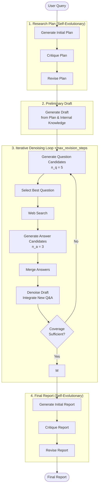

# Deep Research Processing Flow

Based on the algorithm proposed in **R. Han et al., "Deep Researcher with Test-Time Diffusion"** (arXiv:2507.16075).

---

## Overview

This implementation follows the **Test-Time Diffusion Deep Researcher (TTD-DR)** framework, which treats research report generation as a diffusion process. A preliminary draft is iteratively refined ("denoised") using dynamically retrieved external information, guided by a self-evolutionary algorithm applied to each component.

Key parameters:

- `max_revision_steps` = 3 (paper used 20)
- `n_q` = 5 (question candidates per step)
- `n_a` = 3 (answer candidates per step)

---

## Processing Flow

---

## Component Details

### Research Plan — Self-Evolutionary

The plan is generated in three LLM calls: initial draft → critique → revision. This mirrors the paper's self-evolutionary mechanism applied to each agentic component.

### Preliminary Draft

Written from the LLM's internal knowledge only, structured around the research plan. Serves as the evolving "noisy" document that the diffusion process will refine.

### Iterative Denoising Loop

Each iteration corresponds to one diffusion step:

| Sub-step                | Description                                                                                                          |
| ----------------------- | -------------------------------------------------------------------------------------------------------------------- |
| **Question generation** | Produce `n_q = 5` candidate questions targeting gaps in the current draft, then select the best one                  |
| **Answer retrieval**    | Search the web for the chosen question; generate `n_a = 3` candidate answers from retrieved documents and merge them |
| **Draft denoising**     | Revise the full draft by integrating the new Q&A pair; reduces "noise" (uncertainty, gaps) in the report             |
| **Exit check**          | LLM evaluates coverage of each plan section; stops early when all sections are adequately covered                    |

### Final Report — Self-Evolutionary

Applies the same critique-and-revision loop to produce a polished final output.
