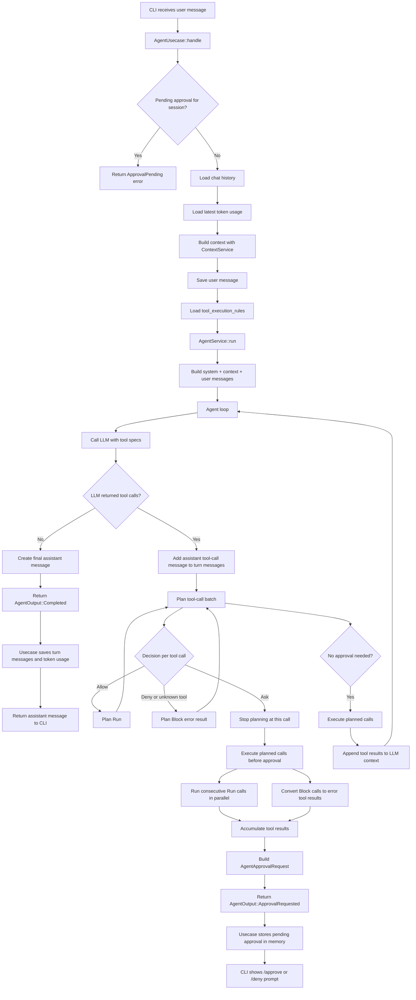

# Agent Process Flow

This document describes the current Commander agent flow.

The implementation is split across the presentation, application, domain, and
infrastructure layers:

- `agent_cli.rs` handles commands, user input, and progress display.
- `AgentUsecase` coordinates repositories, context building, pending approvals,
  and persistence.
- `AgentService` owns the LLM/tool loop and approval pause/resume behavior.
- `ToolExecutor` looks up tools, checks each tool's default execution policy,
  and executes tools.
- Repositories persist chat messages, token usage, tool approval logs, and tool
  execution rules.

## Main Flow



## Tool Execution Decisions

Each tool call is evaluated in two steps:

1. The tool implementation returns a default `ToolExecutionPolicy`.
2. `ToolExecutionRules` combines that policy with the persisted rule for the
   tool name.

The effective decision is:

| Tool policy | Stored rule | Decision |
| --- | --- | --- |
| `Auto` | none | `Allow` |
| `Ask` | none | `Ask` |
| `ConfirmEveryTime` | any non-deny rule | `Ask` |
| any policy | `allow` | `Allow`, except `ConfirmEveryTime` stays `Ask` |
| any policy | `ask` | `Ask` |
| any policy | `deny` | `Deny` |

`Deny` is stronger than approval. If a tool is denied, Commander does not
execute it. Instead, it returns an error `ToolResultMessage` to the LLM.

Unknown tools are also converted to error tool results instead of becoming
approval requests.

## Planned Tool Calls

`AgentService` turns a batch of LLM tool calls into planned actions:

- `Run`
  - The tool may execute.
- `Block`
  - The tool will not execute and will produce an error tool result.
- `PendingToolApproval`
  - The loop pauses before this tool call.

When executing a plan, Commander keeps the original order around blocked calls:

```text
Run, Run, Block, Run
```

is executed as:

```text
parallel(Run, Run), Block result, parallel(Run)
```

This preserves the order of tool results while still allowing safe parallelism.

## Approval Request Flow

When a tool call requires approval:

1. Runnable calls before the approval point are executed.
2. Their results are stored in `AgentApprovalRequest.accumulated_tool_results`.
3. The approval target is stored as `pending_tool_call`.
4. Tool calls after the approval target are stored as `remaining_tool_calls`.
5. Resume context is stored in memory as part of the pending approval.
6. `AgentOutput::ApprovalRequested` is returned to the usecase.
7. The usecase stores the pending approval in an in-memory map keyed by
   `session_id`.
8. The CLI prints a confirmation prompt.

Pending approvals are currently in-memory only. They do not survive process
restart.

## Approve Flow

When the user runs `/approve`:

1. The usecase reads the pending approval without removing it.
2. The approval decision is written to `tool_call_approvals`.
3. The `/approve` user message is saved.
4. Current `tool_execution_rules` are loaded.
5. `AgentService::resume_after_approval` resumes the paused loop.
6. The pending tool is re-checked against the current rules.
7. If the current decision is `Deny`, the tool is not executed and an error
   tool result is returned to the LLM.
8. Otherwise, the approved tool executes.
9. Remaining tool calls are processed with the current rules.
10. If the resumed loop completes, turn messages and token usage are saved.
11. The pending approval is cleared only after the resumed loop completes and
    the output is saved.
12. If the resumed loop pauses for another approval, the new pending approval
    remains in memory.

If a save or resume step fails, the pending approval remains available for a
retry.

## Deny Flow

When the user runs `/deny`:

1. The usecase reads the pending approval without removing it.
2. The denial decision is written to `tool_call_approvals`.
3. The saved turn messages from the paused turn are persisted.
4. Tool results are persisted for:
   - tool calls that already ran before the approval pause,
   - the denied pending tool call,
   - remaining tool calls skipped because of the denial.
5. The `/deny` user message is saved.
6. An assistant denial message is saved.
7. The pending approval is cleared only after the deny flow succeeds.

This keeps the chat history consistent even when some tools had already run
before the approval pause.

## Persistence Summary

Persisted:

- Chat messages.
- Token usage per LLM message.
- Tool approval decisions in `tool_call_approvals`.
- Tool execution rules in `tool_execution_rules`.

In memory:

- Pending approval resume state.

Not implemented yet:

- Durable pending approval recovery after process restart.
- Transactional persistence across all approval/deny side effects.
